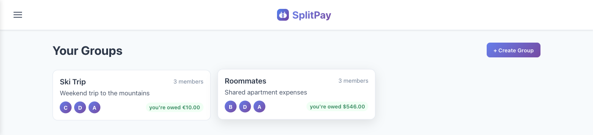
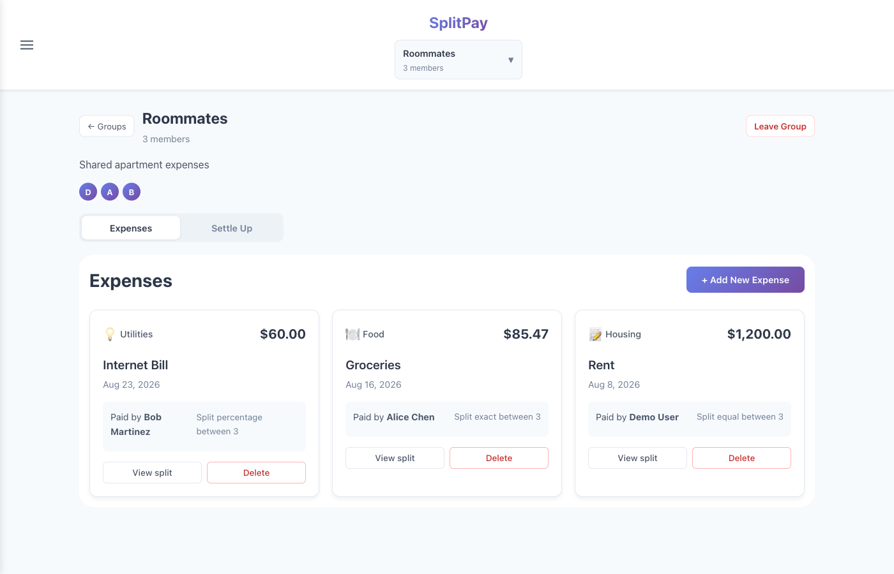
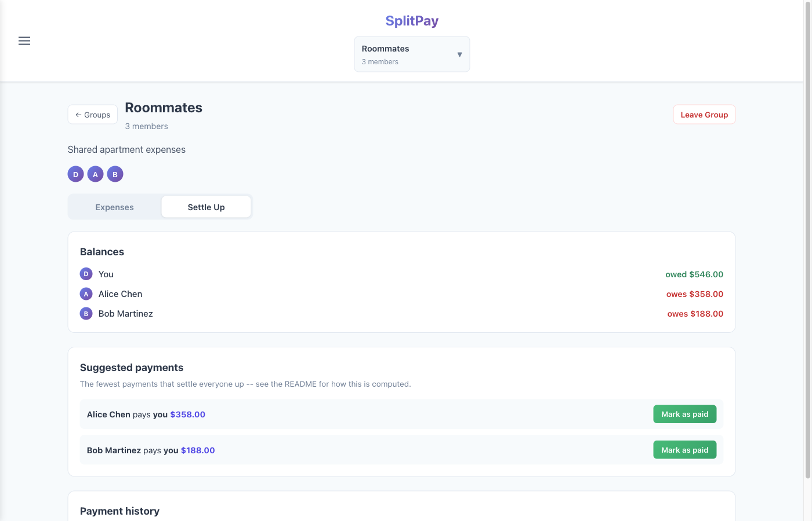

# SplitPay

A group-expense splitter: create a group, log shared expenses with three
different split types, and get back the fewest payments needed to settle
everyone up.

**Live demo:** https://gregoryzli.github.io/expense-splitter/
Log in as `demo@example.com` / `password123` (or `alice@`, `bob@`,
`carol@example.com`, same password) to see it pre-loaded with two groups
mid-lifecycle rather than an empty state -- one in EUR, one in USD, and
`demo` already has a few saved friends.

> The backend is on a free-tier host that spins down after 15 minutes idle.
> If it's been a while since the last visit, the first request can take
> 10-20s to wake back up — that's a cold start, not a bug.

## Screenshots

**Dashboard**



**Expenses — equal, exact, and percentage splits in the same group**



**Settle Up — suggested payments computed from the group's balances**



## Stack

| Layer | Choice |
|---|---|
| Frontend | React (Create React App), plain `fetch` + a small `useAsync` hook — no data-fetching library |
| Backend | Express 5 + TypeScript |
| Database | MySQL (TiDB Serverless in production, MySQL 8 via Docker for local dev) |
| ORM | Prisma |
| Validation | zod |
| Auth | JWT in an httpOnly cookie, `bcryptjs` for password hashing |
| Tests | vitest + supertest — 92 tests (unit + integration against a real MySQL instance) |
| Backend hosting | Render (free-tier Docker web service) |
| Frontend hosting | GitHub Pages, via GitHub Actions |

See [docs/ARCHITECTURE.md](docs/ARCHITECTURE.md) for the full data model, API
surface, and the reasoning behind each of these choices (including the ones
I'd do differently in a production system).

## The settle-up algorithm

Given a group's balances — who's owed money, who owes money, always summing
to zero — the goal is to find the smallest set of payments that zeroes
everyone out.

The exact minimum is NP-hard: it reduces to a set-partition problem (find
the fewest subsets of the balances that each sum to zero), and deciding
whether even one such zero-sum subset exists is the subset-sum problem.
There's no known polynomial algorithm for the exact optimum.

What's implemented instead is the same greedy heuristic real apps like
Splitwise use: repeatedly match whoever is owed the most with whoever owes
the most, settle the smaller of the two amounts, and repeat.

```
sort creditors (balance > 0) and debtors (balance < 0) by amount, descending
i = 0, j = 0
while i < creditors.length and j < debtors.length:
    pay = min(creditors[i].amount, debtors[j].amount)
    record payment: debtors[j] -> creditors[i], amount = pay
    creditors[i].amount -= pay
    debtors[j].amount -= pay
    if creditors[i].amount == 0: i += 1
    if debtors[j].amount == 0: j += 1
```

- **Complexity:** `O(n log n)` — the sort dominates; the matching pass is `O(n)`.
- **Bound:** guarantees at most `n − 1` payments for `n` people with a nonzero
  balance, which is also the worst-case lower bound (balance sets exist that
  genuinely need `n − 1` payments), so the heuristic is asymptotically tight
  even on inputs where it isn't the exact optimum.
- **Where it's not exactly optimal:** if a subset of balances happens to sum
  to zero on its own, an exact solver can sometimes find one fewer payment
  than greedy. For small `n` (say ≤ 15), that exact optimum is reachable
  with a bitmask DP over subsets (`O(2^n · n)`); it isn't implemented here
  because it isn't worth the added complexity at the group sizes this app
  targets.

It's implemented as a pure function, `computeSettlement(balances): Payment[]`,
with no I/O — [`backend/src/services/settleUp.ts`](backend/src/services/settleUp.ts) —
which is what makes it cleanly unit-testable: alongside example-based tests,
[`backend/tests/unit/settleUp.test.ts`](backend/tests/unit/settleUp.test.ts) runs
property-based checks (balances always net to zero after applying every
payment, no payment exceeds either party's original balance, output size
never exceeds `n − 1`) against randomized inputs rather than fixed cases.

## Other things worth knowing about the implementation

- **Money is integer cents everywhere**, never floats. Splitting $10.00
  three ways as floats gives `3.333...`; storing/computing in cents and
  converting to dollars only at the API boundary avoids that entirely. An
  unequal/percentage split still has to land on exact cents that sum back
  to the total, which is what
  [`allocateByWeights`](backend/src/lib/money.ts) (largest-remainder method)
  handles.
- **Auth is a stateless JWT in an httpOnly cookie**, not `localStorage` (not
  readable by JS, so not exfiltratable via XSS) and not a server-side
  session store (no extra persistence layer to run for a single-instance
  deploy). The honest tradeoff: no server-side revocation, mitigated with a
  short expiry rather than building refresh-token rotation.
- **Every group-scoped route checks group membership** before touching
  balances or expenses — the one piece of authorization logic that actually
  matters, since this is financial data.
- **Settlements need the other person's confirmation** before they affect
  balances. Marking a payment "paid" records it as `PENDING`; only the
  counterparty can confirm it, so a mistaken (or bad-faith) "mark as paid"
  can't unilaterally shrink what someone owes.
- **Currency is a per-group label, not real currency tracking.** It's set
  once when a group is created and only changes which symbol
  `Intl.NumberFormat` uses for that group's numbers — nothing converts
  between currencies or verifies what currency an amount was actually
  entered in.
- **Leaving a group with a nonzero balance doesn't get blocked.** It used
  to; now it always succeeds and leaves an `UnresolvedDeparture` behind for
  whoever's left to resolve — either write off the balance (auto-recorded
  as if it had actually been settled) or split it evenly across the
  remaining members. The alternative, silently dropping someone's debt off
  the ledger the moment they leave, seemed worse than a small banner.
- **Account deletion is soft-only.** Expenses and settlements reference
  users with no cascade, so a hard delete would either violate a foreign
  key or erase other people's expense history along with the deleted
  account. Deleting an account deactivates login and email/search
  visibility, then runs every group membership through the same departure
  logic leaving does — it doesn't get a separate code path.
- **Friends are a one-directional saved-contacts list**, not a mutual
  relationship. Saving someone doesn't notify them or add you to their
  list — it just remembers people so creating a new group doesn't mean
  re-searching for the same people every time.

## Running it locally

```bash
git clone https://github.com/gregoryzli/expense-splitter.git
cd expense-splitter
docker compose up -d          # MySQL + backend, http://localhost:3001
cd backend && npm run seed    # optional: same demo data as the live site
cd ../frontend && npm install && npm start   # http://localhost:3000
```

Backend `.env` (see `backend/.env.example`) needs `DATABASE_URL`,
`JWT_SECRET`, `CORS_ORIGIN`, and `COOKIE_SECURE=false` for local HTTP.
Running the backend outside Docker (`cd backend && npm run dev`) works too,
against the same docker-compose MySQL container.

### Tests

```bash
cd backend
npm run test:db:setup   # one-time: migrates a separate expense_splitter_test DB
npm test
```

## Deployment

Backend and frontend deploy independently and auto-redeploy on push to
`main`: the backend via Render's Docker build (`render.yaml`), the frontend
via a GitHub Actions workflow to GitHub Pages
(`.github/workflows/deploy-pages.yml`). A second workflow
(`.github/workflows/keep-alive.yml`) pings the backend every 14 minutes to
offset Render's free-tier idle spindown. Full first-time setup steps are in
[DEPLOYMENT.md](DEPLOYMENT.md).

## What's explicitly out of scope

- Cross-group netting (a global balance across every shared group, the way
  Splitwise does it) — settle-up here is scoped per group.
- Real currency conversion — a group's currency is a display label only
  (see above); nothing converts between currencies or enforces that
  amounts were actually entered in the selected one.
- Real payment processing — a "settlement" is a record of an out-of-band
  payment (cash, Venmo, whatever actually happened), not a processed
  transaction.
