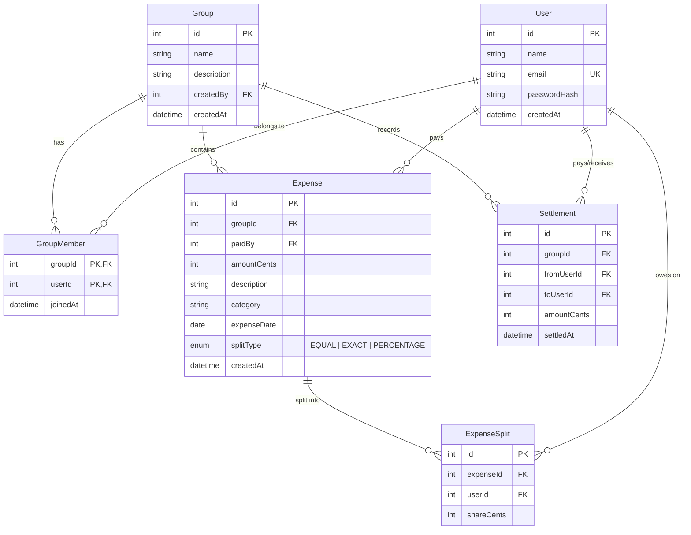

# Architecture Plan

Status: proposed, stage 2 of the rewrite (see repo history for stage 1 audit). Not yet implemented.

## Data model

Money is stored as **integer cents** (`Int` in Prisma / `BIGINT`-safe range in MySQL), not
`FLOAT` and not even `DECIMAL`. Splitting $10.00 three ways as floats gives you
`3.333333...`, and summing decimals back up is a classic source of off-by-a-cent bugs.
Integer cents make split arithmetic exact: divide, take the remainder, hand the leftover
pennies to the first N people. The API converts to/from dollars at the edge (request/response
serialization); the database and all internal math never touch floating point.



Notes on the model:

- **`GroupMember` is a real join table**, not a JSON array of ids (the old `mockData.js` shape).
  This lets a `GET /groups/:id` query join straight to `users` instead of the frontend doing
  N+1 `getUserById` lookups, which is what the current code does.
- **`ExpenseSplit` stores the computed share per person**, not just a list of participant ids.
  That's what makes unequal/percentage splits possible: for `EQUAL` splits the server computes
  and stores each share at creation time; for `EXACT`/`PERCENTAGE` the client sends shares and
  the server validates they sum to the total. Either way, balance calculation later is just
  `SUM(shareCents) WHERE paidBy = X` vs `SUM(shareCents) WHERE userId = X` — no runtime
  division, no re-deriving from `amount / n`.
- **`Settlement` is a real table**, not just a computed suggestion. Suggested settlements
  (from the algorithm below) are ephemeral and computed on request; when a user actually marks
  a payment as made, that's a row here. This is what lets balances be recomputed correctly
  after a partial settlement.
- Deleting a `User` or `Group` is a soft concern I'm deferring: for a portfolio scope, I'd
  block deletion of a group with any expenses, and block removing a group member with a
  nonzero balance, rather than building soft-delete/audit-trail machinery.

## API surface

All routes are versioned-free (`/api/...` — no `/v1`, not worth it at this scale) and return
JSON. Standard error shape:

```json
{ "error": { "message": "Email already in use", "code": "EMAIL_TAKEN" } }
```

| Method | Route | Auth | Purpose |
|---|---|---|---|
| POST | `/api/auth/register` | — | create user, sets auth cookie |
| POST | `/api/auth/login` | — | verify credentials, sets auth cookie |
| POST | `/api/auth/logout` | — | clears cookie |
| GET | `/api/auth/me` | required | current user (for session rehydration on page load) |
| GET | `/api/users?search=` | required | search users by name/email, for adding real members to a group |
| GET | `/api/groups` | required | groups the current user belongs to |
| POST | `/api/groups` | required | create group (creator is auto-added as member) |
| GET | `/api/groups/:id` | member | group details + members + balances |
| PATCH | `/api/groups/:id` | creator | rename/edit description |
| POST | `/api/groups/:id/members` | member | add a member by email |
| DELETE | `/api/groups/:id/members/:userId` | self or creator | remove member (blocked if nonzero balance) |
| GET | `/api/groups/:id/expenses` | member | list expenses |
| POST | `/api/groups/:id/expenses` | member | create expense + splits |
| GET | `/api/expenses/:id` | member | single expense detail |
| PATCH | `/api/expenses/:id` | payer or creator | edit expense |
| DELETE | `/api/expenses/:id` | payer or creator | delete expense |
| GET | `/api/groups/:id/balances` | member | net balance per member (who's owed, who owes) |
| GET | `/api/groups/:id/settlements/suggestions` | member | **the settle-up algorithm** — minimal-transaction payment plan, computed on the fly, not persisted |
| GET | `/api/groups/:id/settlements` | member | settlement history |
| POST | `/api/groups/:id/settlements` | member | record an actual payment (from, to, amount) |

Every group-scoped route checks the requester is a `GroupMember` (403 if not) — this
is the one piece of authorization logic that matters most, since balances and expenses
are financial data.

Validation: every request body is parsed through a `zod` schema before touching a
controller; failures return `400` with the zod issue list mapped into the standard
error shape. A small `validate(schema)` Express middleware wraps this so it's not
repeated per route.

Status codes used deliberately, not just 200/500: `400` validation, `401` no/invalid
session, `403` authenticated but not a group member, `404` not found, `409` conflict
(duplicate email, duplicate group member), `422` semantically invalid (e.g. splits
don't sum to the expense total), `500` unexpected.

## Auth approach

**JWT in an httpOnly, Secure, SameSite=Lax (or None if frontend/backend end up on
different domains) cookie** — not `localStorage`, and not server-side sessions.

Why not sessions: a session store needs a persistence layer (a `sessions` table, or
Redis) and, if you ever run more than one backend instance, either sticky sessions or
a shared store. None of that is wrong, it's just infrastructure this project doesn't
need to prove the point, and it adds a moving part to the free-tier deploy in stage 6.

Why not `localStorage` JWTs: a token in `localStorage` is readable by any JS running on
the page, which means it's exfiltratable via any XSS bug, including from a dependency.
An httpOnly cookie is invisible to JS entirely — the browser sends it automatically,
and a cross-site request still needs a matching `SameSite`/CORS configuration, so it's
not a free-for-all either.

The honest tradeoff I'm accepting: this is a stateless JWT with no server-side
revocation list. Logout clears the cookie client-side; a stolen token is valid until
it expires. I'm mitigating that with a short expiry (7 days) rather than building
token revocation or refresh-token rotation — that machinery is a legitimate next step
for a production app, and worth naming explicitly in an interview as "the thing I'd
add first," but it's disproportionate for this project's scope.

Password hashing: `bcryptjs` (pure JS), not native `bcrypt`. Native `bcrypt` is faster,
but requires a compiled native addon, which means the Docker image needs build tools
matching the deploy platform's architecture. `bcryptjs` trades a bit of hashing speed
for a Docker image that just works — a reasonable call for a login endpoint that isn't
under real load.

## The settle-up algorithm

This is the part worth being precise about, since it's the thing you specifically
want to defend in an interview.

**The problem:** given each member's net balance in a group (positive = owed money,
negative = owes money, and the balances always sum to zero), find a set of
payments — who pays whom, how much — that zeroes every balance out, using as few
payments as possible.

**The exact minimum is NP-hard.** It's equivalent to a set-partition-style problem:
you're looking for the smallest number of groups into which the balances can be
partitioned such that each subset sums to zero, and deciding whether *any* subset
of a set of numbers sums to zero is itself the subset-sum problem. There's no known
polynomial algorithm for the exact optimum in general.

**What real apps (including Splitwise) do, and what I'll implement:** a greedy
heuristic — repeatedly match the person owed the most money with the person who
owes the most money, settle the smaller of the two amounts between them, and
repeat.

```
sort creditors (balance > 0) descending, debtors (balance < 0) descending by magnitude
i = 0, j = 0
while i < creditors.length and j < debtors.length:
    pay = min(creditors[i].amount, debtors[j].amount)
    record payment: debtors[j] -> creditors[i], amount = pay
    creditors[i].amount -= pay
    debtors[j].amount -= pay
    if creditors[i].amount == 0: i += 1
    if debtors[j].amount == 0: j += 1
```

**Why this is a defensible choice, not just "good enough":**
- It's **optimal in the two-party case** trivially, and for the general case it
  guarantees **at most n − 1 transactions** for n people with nonzero balance —
  which is also the theoretical lower bound in the worst case (you can construct
  balance sets that genuinely need n − 1 payments), so the heuristic is
  asymptotically tight even though it's not always the exact optimum for every
  input.
- It's **fast**: sort is `O(n log n)`, the matching pass is `O(n)`, so `O(n log n)`
  total — trivial at the scale of a group of people, but it's the right way to
  answer "what's the complexity" in an interview.
- The cases where greedy isn't exactly optimal are ones where a subset of balances
  happens to sum to zero on its own (e.g. balances `[+30, +30, -30, -30]` can settle
  in 2 payments by pairing same-magnitude opposites, and greedy will actually find
  that here — but adversarial inputs exist where an exact solver would find one
  fewer transaction than greedy). I'll note this tradeoff in the README rather than
  hide it, and it's a good "what would you improve" answer: for small n (say ≤ 12–15)
  you could brute-force/DP over subset bitmasks for the exact optimum, since the
  state space is `O(2^n · n)`.

I'll implement this as a pure function (`computeSettlement(balances): Payment[]`)
with no I/O, which is what makes it cleanly unit-testable in stage 5 — property-based
tests (balances always sum to zero after applying all payments, payments never exceed
either party's original balance, output size ≤ n − 1) alongside example-based ones.

## What's explicitly out of scope

- Cross-group netting (Splitwise's global "friends" balance across all shared groups) —
  settle-up is scoped per group, which matches the data model and keeps the algorithm's
  input well-defined.
- Multi-currency — everything is USD cents for this pass.
- Real payment processing (Stripe etc.) — "settlements" are a record of an
  out-of-band payment (cash, Venmo, whatever), not a processed transaction.
